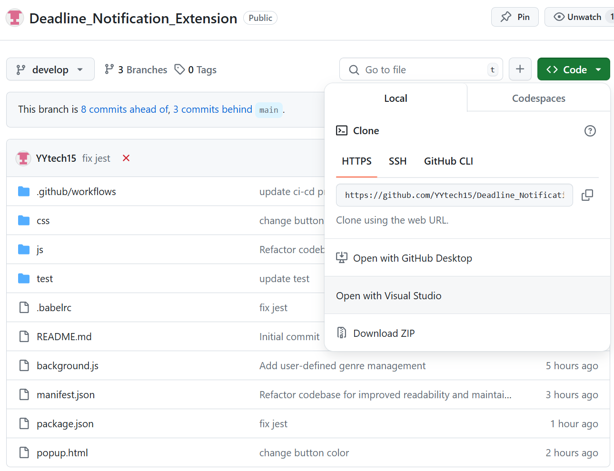
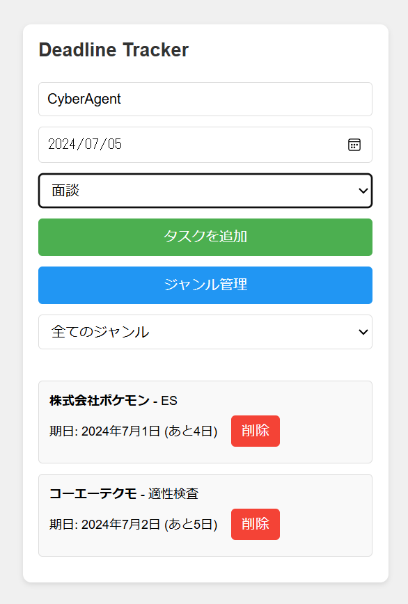
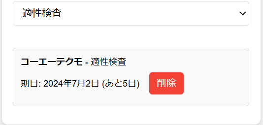

# Deadline Tracker - Chrome or Edge拡張機能

## 目次
- [Deadline Tracker - Chrome or Edge拡張機能](#deadline-tracker---chrome-or-edge拡張機能)
  - [目次](#目次)
  - [プロジェクト概要](#プロジェクト概要)
  - [主な機能](#主な機能)
  - [技術スタック](#技術スタック)
  - [プロジェクト構造](#プロジェクト構造)
  - [セットアップ手順](#セットアップ手順)
  - [使用方法](#使用方法)
  - [主要コンポーネントの説明](#主要コンポーネントの説明)
    - [popup.js](#popupjs)
    - [taskManager.js](#taskmanagerjs)
    - [genreManager.js](#genremanagerjs)
    - [modalManager.js](#modalmanagerjs)
    - [utils.js](#utilsjs)
  - [テスト](#テスト)
  - [CI/CD](#cicd)
  - [今後の改善点](#今後の改善点)
  - [貢献方法](#貢献方法)
  - [ライセンス](#ライセンス)

## プロジェクト概要
Deadline Trackerは、就職活動のタスクと締め切りを効率的に管理するためのChrome拡張機能です。ユーザーはタスクをジャンルごとに整理し、締め切りを追跡することで、就活プロセスをスムーズに進めることができます。

## 主な機能
- タスクの追加、表示、削除
- ジャンル（カテゴリー）の管理
- タスクのジャンルによるフィルタリング
- 締め切りまでの日数の計算と表示
- タスクの締め切り日でのソート

## 技術スタック
- HTML/CSS/JavaScript
- Chrome Extension API
- Jest (テスティングフレームワーク)
- GitHub Actions (CI/CD)

## プロジェクト構造
```
job-application-tracker/
│
├── manifest.json           # 拡張機能のマニフェストファイル
├── popup.html              # メインのユーザーインターフェース
├── background.js           # バックグラウンドスクリプト
├── js/
│   ├── popup.js            # メインの制御ロジック
│   ├── taskManager.js      # タスク管理機能
│   ├── genreManager.js     # ジャンル管理機能
│   ├── modalManager.js     # モーダル管理
│   └── utils.js            # ユーティリティ関数
├── css/
│   └── styles.css          # スタイルシート
├── tests/
│   └── popup.test.js       # Jestテストファイル
├── .github/workflows/
│   └── ci-cd.yml           # GitHub Actions CI/CD設定
└── package.json            # プロジェクト依存関係と設定
```

## セットアップ手順
1. リポジトリをクローン　or インストール（Download zip）し任意のディレクトリに保存：
   ```
   git clone https://github.com/yourusername/job-application-tracker.git
   ```
   
2. 拡張機能をデベロッパーモードでロード：
   - Chrome or Edge で 拡張機能の管理 を開く
   - 「デベロッパーモード」をオン
   - 「パッケージ化されていない拡張機能を読み込む」をクリック

## 使用方法
1. Chrome拡張機能のアイコンをクリックしてDeadline Trackerを開く
2. タスク名、期日、ジャンルを入力し、「タスクを追加」をクリック
3. 「ジャンル管理」ボタンで新しいジャンルを追加または既存のジャンルを削除
4. ジャンルフィルターで特定のジャンルのタスクのみを表示

## 主要コンポーネントの説明

### popup.js
メインの制御ロジックを含み、他のモジュールを統合します。

### taskManager.js
タスクの追加、表示、削除、フィルタリング、ソートを管理します。

### genreManager.js
ジャンルの追加、表示、削除を管理します。

### modalManager.js
ジャンル管理用モーダルウィンドウの表示を制御します。

### utils.js
共通のユーティリティ関数とDOM要素の定義を提供します。

## テスト
Jestを使用してユニットテストを実行します：
```
npm test
```

## CI/CD
GitHub Actionsを使用してCI/CDパイプラインを構築しています。`main`,`develop`ブランチへのプッシュ時に自動的にテストとビルドが実行されます。

## 今後の改善点


## 貢献方法
1. このリポジトリをフォーク
2. 新しいブランチを作成 (`git checkout -b feature/AmazingFeature`)
3. 変更をコミット (`git commit -m 'Add some AmazingFeature'`)
4. ブランチにプッシュ (`git push origin feature/AmazingFeature`)
5. プルリクエストを作成

## ライセンス
このプロジェクトは [MIT ライセンス](LICENSE) の下で公開されています。
```